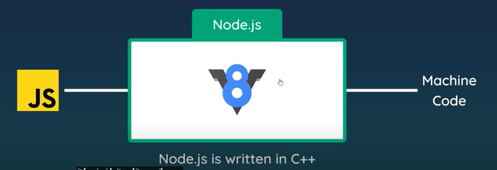
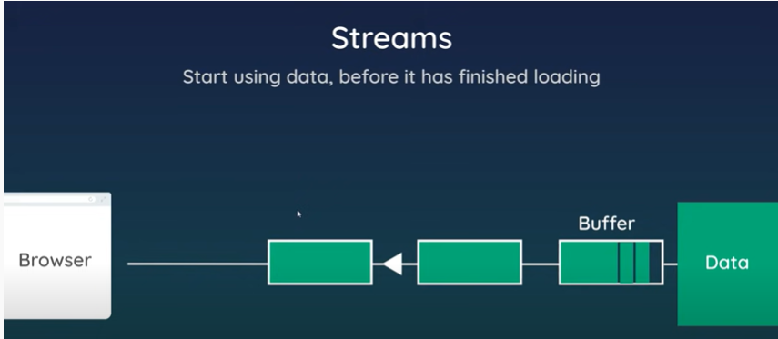
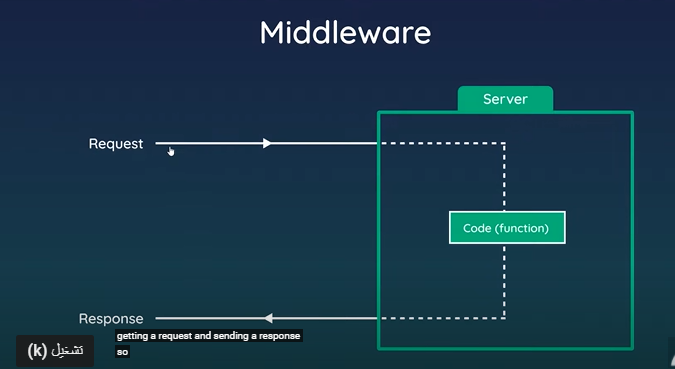
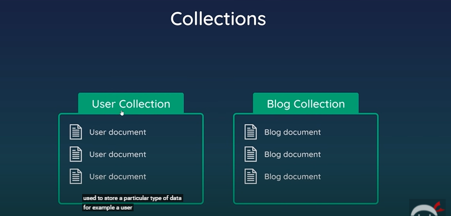
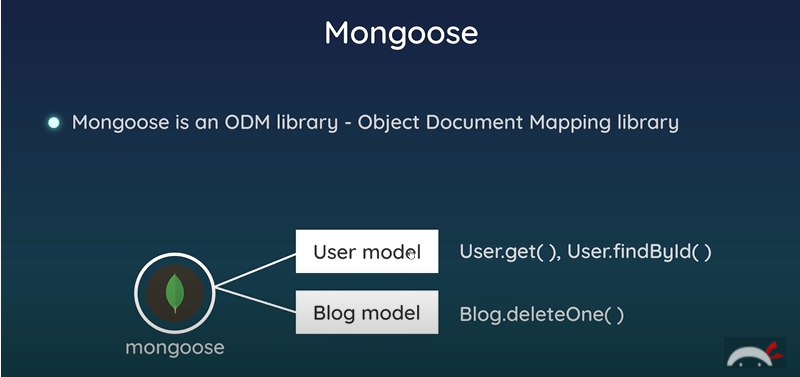
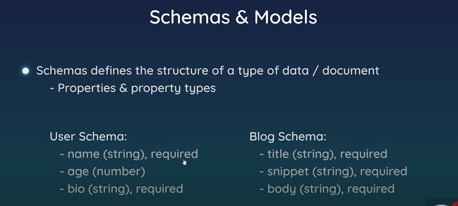
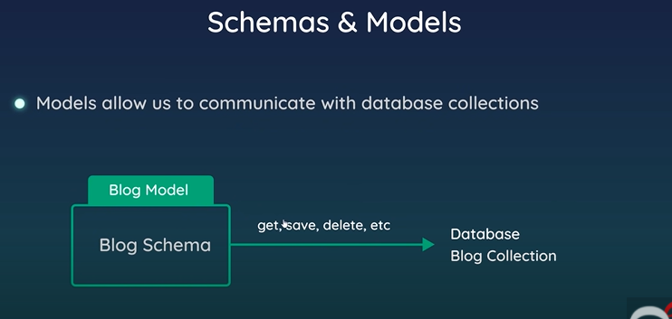
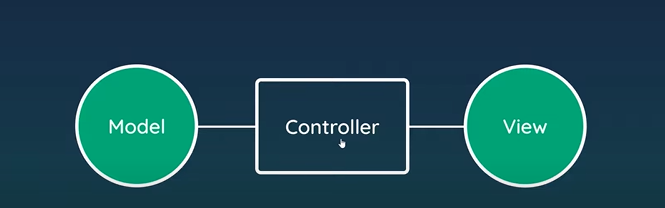

# Node.JS

-node allow to run js directly on server side
how computer actually understand code ?
-computer are really understand machine code but that is really complex to write and read
-computer can not directly understand js or compile it to machine code so we can not directly run js on computer(server side)
-but js can work on browser ? how ?
----an engin called the v8 engin and the v8 engin is written in c++ by google and it is compiles js into machine code at runtime
----so by passing js code through v8 engine in the browser , the computer can then understand js within the context of the browser
-hoeever it can not run js outside the browser because there is no v8 engine compiling it down outside the browser
-okey and this is where the role of node  
-node js is aprogram also written in c++ and that wraps the v8 engine
-so this v8 engine that is in browsers also lives inside node
-well because node written in c++ it can run directly on our computer
-so by installing and running node on our computer it can take our js and can run it through v8 compiler that it has it inside it
-and v8 compiler inside node can compiles js into machine code

-but node is not just a wrapper for the v8 engine it add more features to js
---when we use nodes to compile and run js we also can use all of extra functionallity like :
1.ability to read and write files on a computer/server side(abiltiy to interact with file system on computer using js )

2.connect the database
3.act as a server for acontant  
4.build web server listens ti http requests
5.can use js outside browser / can get info about operating system using built in core modules (os)/require it /then can access methods/props of this os object(os.freemem()/os.totalmem()/os.homedir()/os.platform())

above is abilites or things can do it by using server-side language but we can do it using js which running through node /remember js is originally made for browser to add interactivity and not to run directly on computer or servers but using node we can do the above activites using it in server side
//conclusion
1.use node to run js outside browser
2.add features of (backend side languages )
3.but when we run it outside browser wwe loss access to js features like DOM /we can not interact with html elements but we do not really need it when we running js on a server and acting as back-end to our website

//======================role of Node ==================================//
-basically to run js on back-end/ server side
-then we are going to be handeling requests come from browser
1.make request from browser to server
2.node server will run some kind of js to react to request
3.also node server might communicate with database oe files on server
4.then it is going to formulate some kind of response and send it back to browser
5.that response (server==>brower) could be html bage with dynamic data, and maybe some css /image files ..etc

//===========================why using Node.js =================================//
(if i already have back-end languages like PHP/ruby/python/java/...)

1. familiar with js so no need to learn back-end language (extra language for server )
   2.we use same language in front end and back end so we can also share code between front/back end
   3.popular and massive community around it
   4.there is ahuge amount of third-party packages/tools

//==basic node /terminal instructions================================================
-check if you have node.js installed >
---node -v in terminal (version of node )
-node then enter ===>run js directly inside terminal(writ js code )
---when install node in your computer , you can run js directly in our computer
-exit node in terminal (ctrl c /ctrl d /.exit)

//==running files through Node js ================================================
-write / run js files on our computer
-i have js file on my computer/create js file
-to run js file from terminal in VS/terminal-->new terminal --->in directly--->node fileName(to need to add js extension because it know you want to run js file)/terminal will act as console for us
-so in node js / i can run js file using VS terminal / linux terminal by write node fileName (no need to js extension because already know that node will run js file on our computer )
-terminal will act as console in browser (ant things logs in file will appear)

//====global object=====================================================
in browser /front end ===>global object is window
but in node the global object is global and that present the global context in the node environment

//===========streams/buffers=====================================================//

//=================middlewares================================================//

//=============================mongoDB==============================================//
collection:

document:

mongoose:

schema:

model:

//=======================MVC ===========================================//

